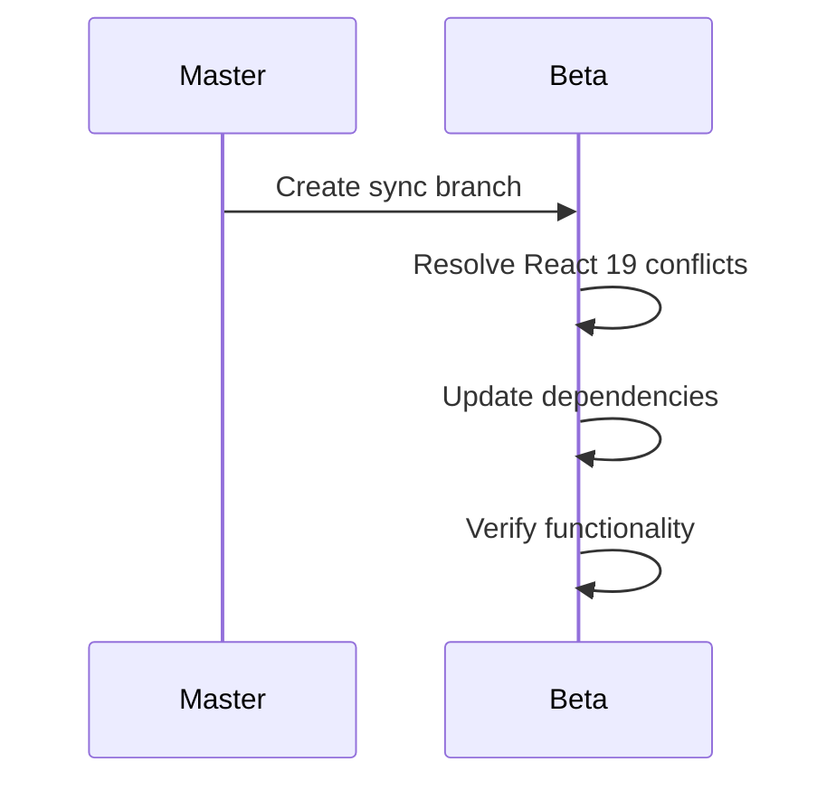

# Architecture Overview

`@halvaradop/ui` is a modern, accessible, and customizable React UI component library, organized as a monorepo for scalability and maintainability. It leverages pnpm workspaces, TurboRepo, and TailwindCSS v4 for efficient development and consistent theming.

## Monorepo Structure

The project uses [`Turborepo`](https://turbo.build/repo) with [`pnpm`](https://pnpm.io) to manage isolated, versioned packages efficiently.

```
ui/
├── .github/              # GitHub workflows, contribution guidelines, and codeowners
├── .storybook/           # Storybook configuration files
├── packages/             # Component and utility packages
│   ├── ui-core/          # Shared logic, types, merge utilities
│   ├── ui-utils/         # Shared configuration: tsup, tsconfig
│   ├── ui-slot/          # Slot component (decoupled from ui-core)
│   ├── ui-template/      # Boilerplate for new components
│   └── ...               # More UI packages
├── scripts/              # Utility scripts (e.g., build, release)
├── tests/                # E2E tests using Playwright
├── tailwind.css          # CSS theme and variable declarations
├── turbo.json            # Turborepo config
└── CHANGELOG.md          # Global changelog for shared/structural changes
```

### Root

- **README.md**: General documentation and usage instructions.
- **tailwind.css**: Shared TailwindCSS theme and variables.
- **turbo.json**: TurboRepo configuration.
- **pnpm-workspace.yaml**: Declares workspace packages.
- **playwright.config.ts**: E2E testing configuration.
- **.storybook/**: Storybook setup for component development.

### Packages Directory

Each package in `packages/` is independently published and follows this convention:

- `index.tsx`: Main component logic
- `index.stories.tsx`: Storybook stories
- `package.json`: Local config (name, peerDeps, version)
- `CHANGELOG.md`: Component-specific changelog
- `README.md`: Usage and description

Key packages:

- `@halvaradop/ui-core`: Shared types/utilities (e.g., `merge`, type helpers).
- `@halvaradop/ui-button`, `@halvaradop/ui-checkbox`, etc.: Individual UI components.
- `@halvaradop/ui-slot`, `@halvaradop/ui-utils`: Internal helpers and advanced composition.
- `@halvaradop/ui-template`: Boilerplate for new components.

#### Example: `@halvaradop/ui-core`

- Exports type helpers and utilities for class name management.
- Used as a dependency by all other UI packages.

#### Example: `@halvaradop/ui-button`

- Customizable Button component.
- Depends on `ui-core` for types/utilities and `ui-slot` for composition.
- Supports variants, sizes, and asChild composition.

## Component Standards

- Built with **React** + **TypeScript**
- Style management via **TailwindCSS v4** and CSS variables
- Composable structure using [Compound Component Pattern](https://www.patterns.dev/react/compound-pattern/)
- Accessibility via WAI-ARIA roles and semantic HTML

## Branching & Versioning Strategy

| Branch          | React Version | Tailwind Version | Status |
| --------------- | ------------- | ---------------- | ------ |
| master          | React 19      | Tailwind v4      | Stable |
| legacy/react-18 | React 18      | Tailwind v4      | Legacy |

- `master`: Current stable branch (React 19, Tailwind v4)
- `legacy/react-18`: Legacy support branch (React 18, Tailwind v4)



## Internal Utilities

- `@halvaradop/ui-core`: Shared logic (e.g., `merge`, SlotProps, HTML typing).
- `@halvaradop/ui-utils`: Internal config (e.g., `tsup.config`, docs helpers).

## Build & Development

- **TurboRepo**: Orchestrates build, dev, and clean scripts across packages.
- **Storybook**: Local development and documentation.
- **TailwindCSS**: Styling with shared theme and dark mode support.
- **Playwright**: E2E and visual regression testing.
- **Prettier + ESLint**: Code formatting and linting.
- **GitHub Actions**: CI for linting, testing, release, and branch syncing.

### Example Turborepo Config

```json
{
  "$schema": "https://turbo.build/schema.json",
  "tasks": {
    "build": {
      "dependsOn": ["^build"],
      "outputs": ["dist"],
      "inputs": ["src"],
      "cache": true
    },
    "dev": {
      "dependsOn": ["^dev"],
      "outputs": ["dist"],
      "inputs": ["src"],
      "cache": false,
      "persistent": false
    }
  },
  "ui": "tui",
  "cacheDir": ".turbo/cache",
  "globalDependencies": ["tsconfig.json"]
}
```

### Tsup Configuration

- ESModule and CommonJS outputs
- Type declarations generation
- Source maps for development

## Testing Strategy

- **Unit Tests**: Per-package, recommended for logic-heavy components.
- **E2E Tests**: Playwright for cross-package integration and visual tests.
- **Storybook**: Visual/manual testing and documentation.

## Design Principles

- **Accessibility**: ARIA, keyboard navigation, focus management.
- **Customizability**: Exposed props and CSS variables for theming.
- **Reusability**: Shared types/utilities in `ui-core`.
- **Modern Tooling**: pnpm, TurboRepo, TypeScript, Vite.

## Adding a New Component

See [`CONTRIBUTING.md`](./CONTRIBUTING.md) → “Adding a New Component”.

Steps:

1. Create a new package in `packages/` (e.g., `ui-alert`).
2. Use `ui-core` for shared types/utilities.
3. Follow the structure/conventions of existing packages.
4. Add documentation in the new package's README.
5. Add stories to Storybook.
6. (Optional) Add Playwright tests for E2E coverage.

## Component Design

### Component Structure

```tsx
// 1. Define variants using CVA
const componentVariants = cva("base-styles", {
  variants: {
    variant: { primary: "bg-primary", secondary: "bg-secondary" },
    size: { sm: "text-sm", md: "text-base", lg: "text-lg" },
  },
  defaultVariants: {
    variant: "primary",
    size: "md",
  },
})

// 2. Define component props
interface ComponentProps extends VariantProps<typeof componentVariants> {}

// 3. Implement component
const Component = forwardRef<HTMLDivElement, ComponentProps>(({ className, variant, size, ...props }, ref) => {
  return <div className={merge(componentVariants({ variant, size, className }))} ref={ref} {...props} />
})
```

## Styling System

### CSS Variables

```css
@import "tailwindcss";

@theme {
  --color-success: oklch(75% 0.18 140);
  --color-danger: oklch(65% 0.2 25);

  --color-surface: oklch(98% 0 0);
  --color-on-surface: oklch(20% 0.02 260);

  --color-primary: oklch(30% 0 270);
  --color-on-primary: oklch(95% 0 0);
}
```

### Tailwind Integration

- Uses `@theme` directive in Tailwind v4
- Automatic dark mode support
- CSS variables for dynamic theming

## Accessibility & Contribution

- All components are accessible by default (ARIA, keyboard, focus management).
- Contributions are welcome! See the [Contributing Guide](./CONTRIBUTING.md) and [Code of Conduct](https://github.com/halvaradop/.github/blob/master/.github/CODE_OF_CONDUCT.md).

---

For more details, see individual package READMEs and the master [README.md](./README.md).
